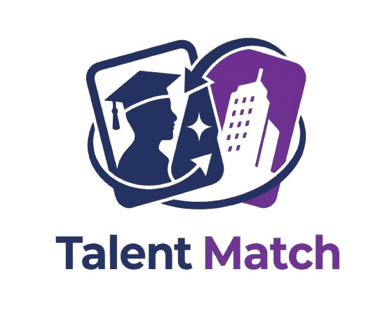

# 🎯 The Talent Match

  

**The Talent Match** es una plataforma gamificada de empleabilidad y networking que conecta estudiantes de máster con empresas y reclutadores mediante matching inteligente, perfiles profesionales enriquecidos y seguimiento de candidaturas.

---

## 🚩 Problema

Los estudiantes de máster suelen tener dificultades para encontrar oportunidades laborales alineadas con su perfil, recibir feedback durante los procesos de selección y construir una red profesional útil.

Por otro lado, las empresas necesitan identificar talento cualificado de forma más rápida, clara y personalizada.

---

## 💡 Solución

**The Talent Match** propone una experiencia digital que transforma la búsqueda de empleo en un proceso más visual, transparente y personalizado.

La plataforma conecta estudiantes, empresas y reclutadores a través de matching inteligente, networking profesional, gamificación y seguimiento de candidaturas.

---

## 🌐 MVP y visualización

🔗 **MVP web:**  
https://www.tmapp.es/

📱 **Mockup responsive:**  
https://ensoin.com/mockupp/

Se ha desarrollado una web para visualizar la experiencia de la app en distintos dispositivos y facilitar la validación del prototipo.

---

## 👥 Perfiles de usuario

| Perfil | Necesidad principal |
|---|---|
| 🎓 Estudiantes | Encontrar oportunidades, mejorar su perfil y hacer networking |
| 🏢 Empresas | Descubrir talento cualificado y afín a sus vacantes |
| 🧑‍💼 Reclutadores | Gestionar candidatos de forma más eficiente |
| 🏫 Universidades | Impulsar la empleabilidad de sus estudiantes |

---

## ⚙️ Funcionalidades principales

| Funcionalidad | Descripción |
|---|---|
| 🤖 **Matching inteligente** | Conecta estudiantes con empresas y oportunidades según intereses, competencias y objetivos profesionales |
| 👤 **Perfil enriquecido** | Permite mostrar formación, experiencia, habilidades, proyectos y preferencias laborales |
| 🔎 **Descubrimiento de oportunidades** | Facilita explorar ofertas, empresas y eventos de forma visual |
| 📌 **Seguimiento de candidaturas** | Muestra el estado de cada aplicación y mejora la transparencia del proceso |
| 💬 **Feedback de empresas** | Permite recibir información útil tras una candidatura o interacción profesional |
| 🤝 **Networking inteligente** | Conecta estudiantes, alumni, empresas y reclutadores según afinidad profesional |
| 🎮 **Gamificación** | Incorpora progreso, logros y retos para motivar la participación activa |

---

## 📸 Vista del prototipo

| Pantalla 1 | Pantalla 2 |
|---|---|
|  |  |

| Pantalla 3 | Pantalla 4 |
|---|---|
|  |  |

| Pantalla 5 | Pantalla 6 |
|---|---|
|  |  |

| Pantalla 7 | Pantalla 8 |
|---|---|
|  |  |

| Pantalla 9 | Pantalla 10 |
|---|---|
|  |  |

---

## 🧪 MVP

El MVP consiste en un **prototipo navegable de alta fidelidad**, orientado a validar el encaje entre problema, público objetivo y solución antes de un desarrollo técnico completo.

El proyecto no busca desarrollar una app final completamente funcional, sino representar la experiencia principal del usuario y validar su utilidad mediante una propuesta visual e interactiva.

---

## 🚀 Estado del proyecto

Proyecto en fase de diseño, validación y desarrollo conceptual como parte del Trabajo Fin de Máster del equipo **Flowly**.

---

## 👩‍💻 Equipo

Desarrollado por **Flowly**.
